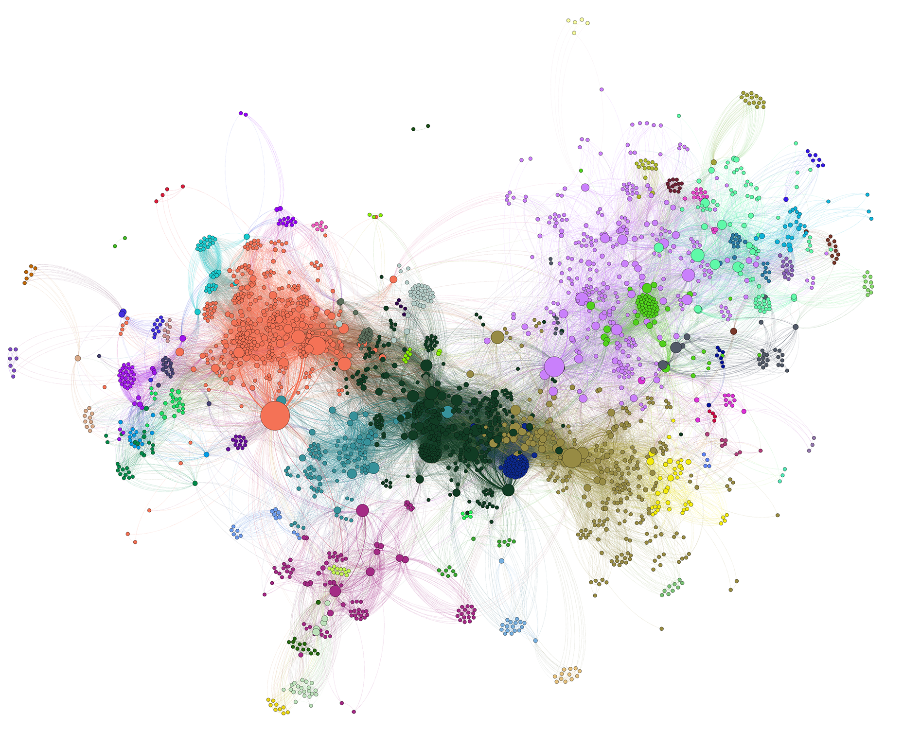
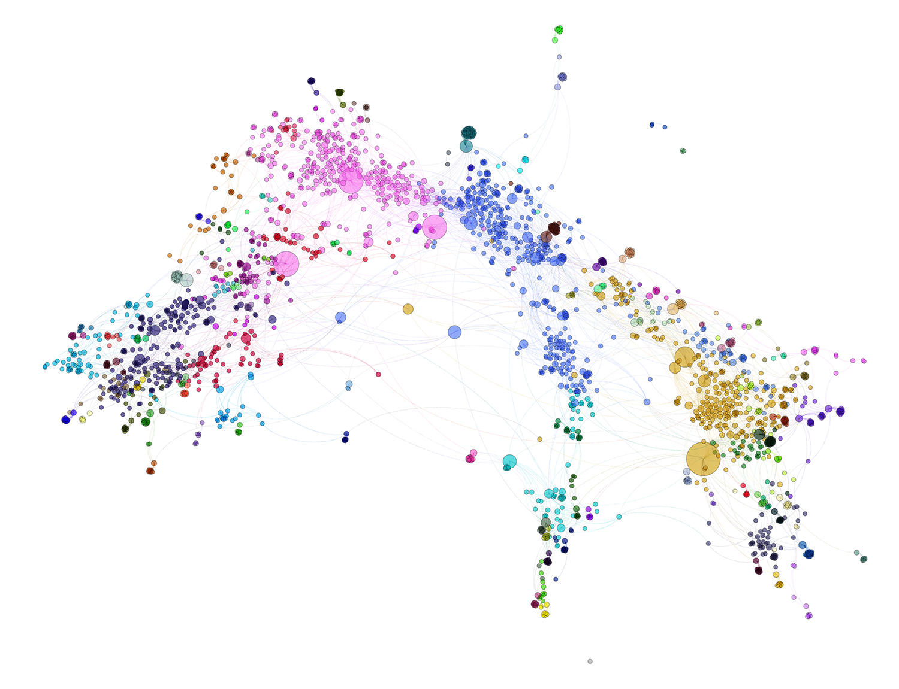
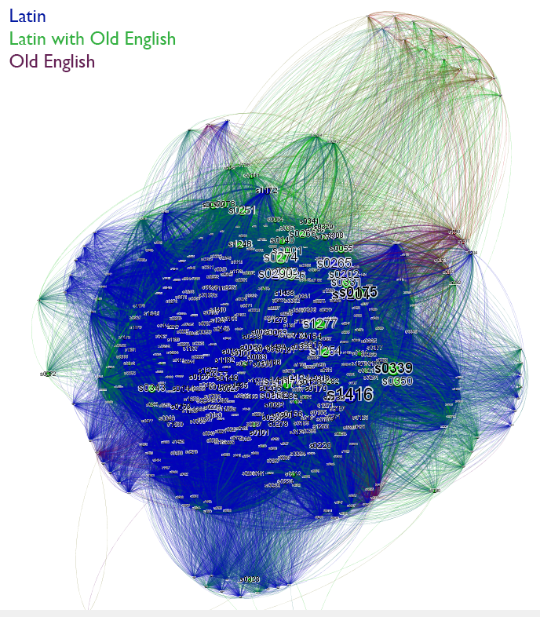
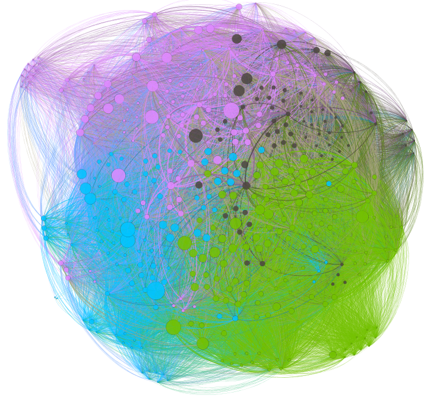
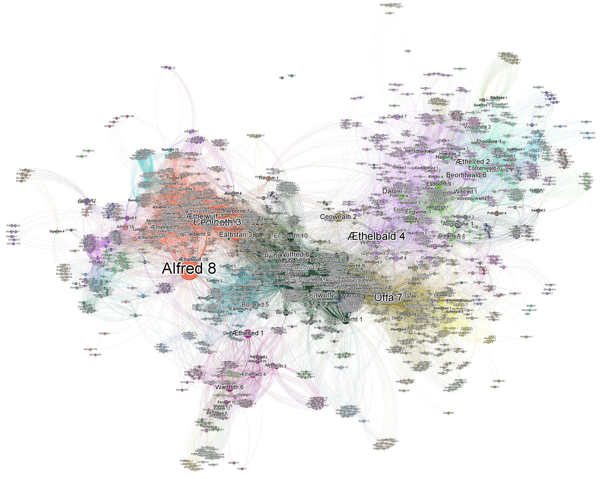
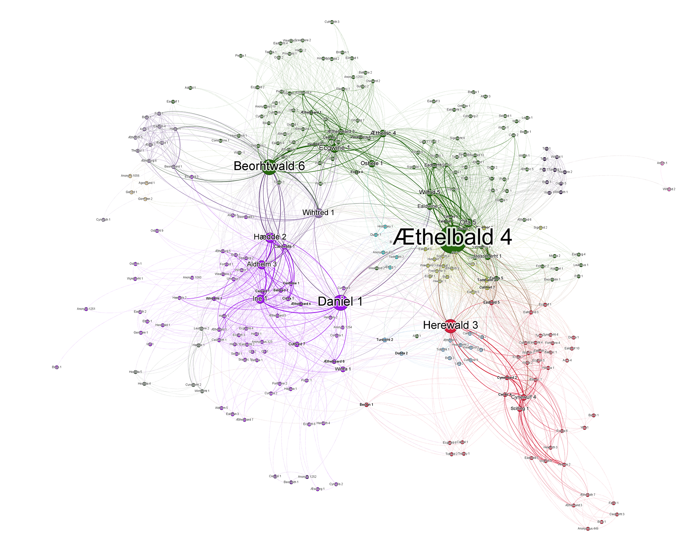
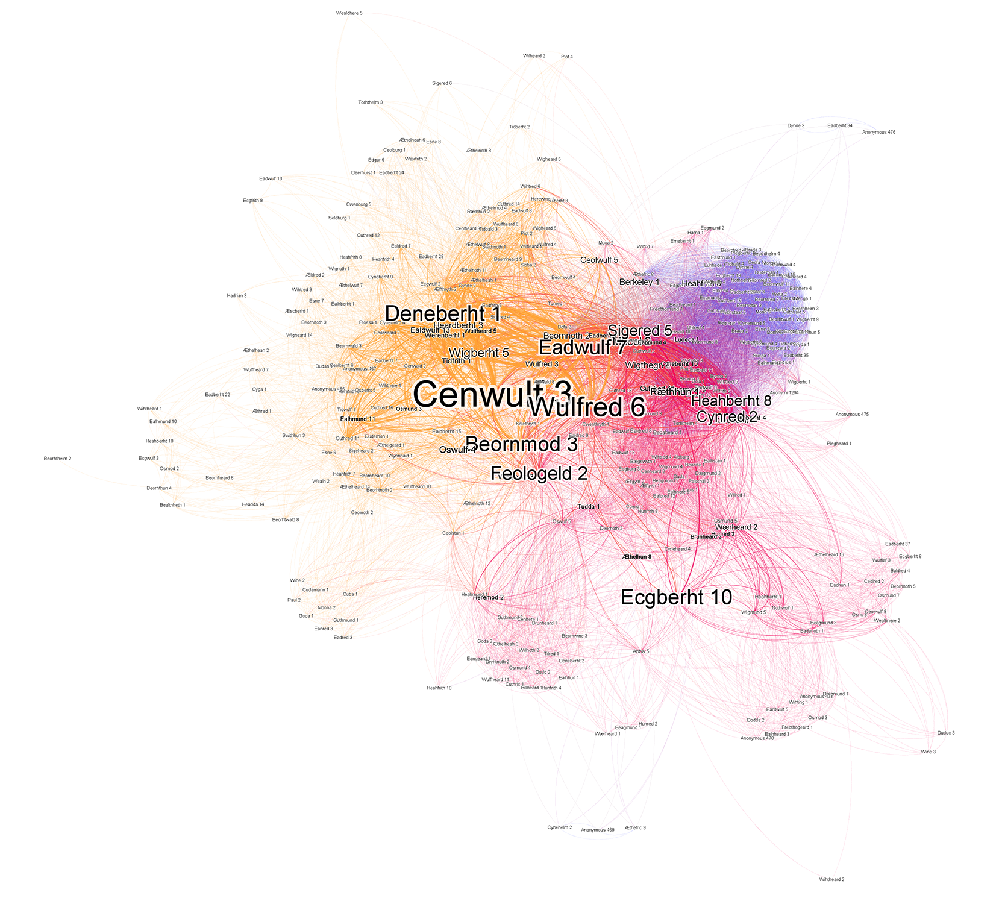
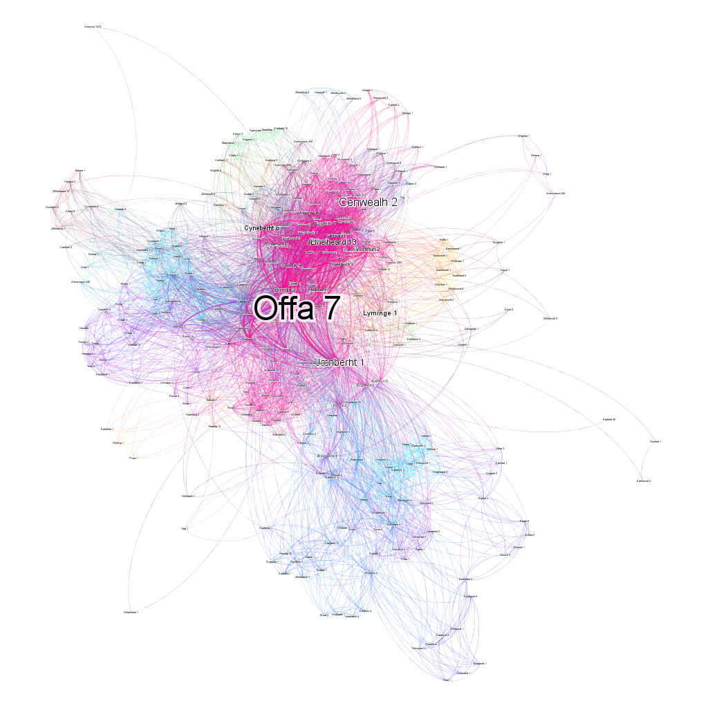
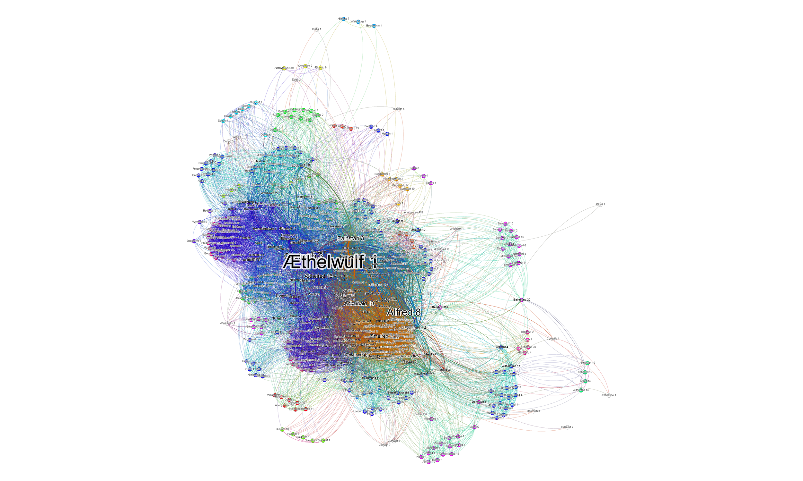

# Inscribing Power in Anglo-Saxon England

This is not a social network.

## The Question

I'm always on the lookout for good sources to demonstrate methods and provoke questions from my students. Recently, I managed to scrape data from the 483 medieval charters Anglo-Saxon database, as well as the 2,526 individuals who appear on them.

During last semester, I first happened upon the Anglo-Saxon Chart Database (ASC). All of the charters date from c.600-900 C.E and are written in a mixture of Latin and Anglo-Saxon. At the time, I was primarily interested in producing material for my students to cut their teeth on while getting started topic modeling and so I scraped the database. Shawn Graham and others have already used network analysis to explore topic models and I wanted my students to be able to follow their method. I wrote a short Python script that converts the output of the TopicModelingTool GUI into graph-ready sheets ready for Gephi or other visualization packages, even allowing you to attach metadata about documents to the results. The results were fruitful, and will appear in a follow-up post shortly.

Last week, inspired by a friend who is a Medievalist, I returned to the ASC. This time, instead of focusing on the texts themselves, I followed the links found on each charter to matching entries in the Prosopography of Anglo-Saxon England (PASE). In addition to further metadata, these pages contains the names of everyone appearing in the documents. Each name given is a unique identifier (e.g. Alfred the Great is Alfred 8). Knowing this, I set out to explore how individuals from this set of sources are linked with one another, through shared representation in the same document(s).

Immediate questions sprang to mind. How tightly interconnected were these people? Would I find a series of disconnected components, or one large network? Who were the key figures in this network? How and why did they appear? Do the patterns of relationships reflected in these charters seem to bear any relationships to political, religious, or other forms of authority we might expect to find?

My main goal is to demonstrate to students and scholars that traditional academic questions can be explored on scales previously unimaginable using resources already available. At the same time, our results are but a simulation, a visual interpretation, of certain selective features of these manuscripts. Yet, none of this can possibly make traditional scholarly interpretation obsolete. These documents bear multiple layers of semantic expression too rich to possibly recreate in their entirety. They are but a narrow interpretation of their own historical contexts, and often a product of dynamic power relationships. Digital methods provide new means of representing our evidence to ourselves. Understanding what digital representation of our sources can actually tell us about the vastly more complex world that produced them demands sensitive scholarly interpretation as much as any other mode of historical inquiry.

## Scholarship

Far from a random choice, I wanted to explore these sources because they (possibly) address an academic problem (disclaimer: I am not a medievalist).  Geoffrey Koziol argues that social rituals and specific diplomatic language partly constituted the authority of the Capetian royal line. By imitating royal formulae in charters (among other things), regional elites reinforced their own social authority. In so doing, they also influence of the monarchy far beyond its previous ambit. Critics point to the distorting nature of these documents, which give a highly selective interpretation of individuals and their relationships. In either case, the multifaceted connections between language and people dominates the issue. While the ASC documents are not only from England, but also date from an earlier period, they nevertheless potentially illuminate this murky issue. I leave it to other scholars to make any larger interpretations of my results.

Status, rather than networked status, is as broad and vague a term as identity. Status can imply one's standing in regard to nearly any issue. Status can describe elements over which an individual has limited or no personal control, such as their age, gender, ethnicity, social class which are often forced upon them by various social and institutional mechanisms. Even here, individuals regularly choose to lie about their biological age, or construct public images of their gender, ethnicities, and social class in diverse ways. Status also refers labels that they consciously adapt, from personal qualities, to legal and civic rights. Statuses can be informal, for example one's claim of being a 'good citizen.' Such claims are often hard to measure. They may also be formal, by which I mean that there are certain commonly accepted criteria that affect one's ability to claim a status with any legitimacy, even if those criteria are not entirely finite or wholly determinative. Crucially, institutions of various kinds play a large, but not exclusive, role in legitimizing formal claims to status. The most obvious example is citizenship, in which one's claims are buttressed by reference to the documents produced by the nation-state in the modern world, or in Classical Athens, by reference to one's parents and fellow demesmen. Both kinds of status depend upon networks of associations in various ways, but murky categories are far harder to interpret, and so networked status is best suited for evaluating the public presentation of formal types of status.
Status claims are fundamentally relational, also both depending upon and creating forms of hierarchy. A comparative example is useful. Medievalists have long struggled with this difficulty when attempting to broach the problems created by deterministic views of 'Feudalism' or 'Nobility.' Despite popular perception, there was no single criteria or title which determined membership in the aristocracy. Elites depended upon a host of titles, claims, social connections and cultural expectations. Even claims of lordship were relational; lord of what, or whom? To quote one medievalist, "such a title was a recognition of power and honor, and of position within a hierarchy of power and honor."

Even, the hierarchy of lordship was not straight forward. The social performance of the rituals recognizing authority had as much force as titles themselves. Furthermore, being lord of one person did not mean suzerainty over their subjects as well. Thus the dictum, 'the man of my man is not my man.' Gerd Althoff argues that Medieval lordships were primarily constituted not by entitlement but by social relations, invoking a host of connections including friends and family who all recognize and support a lord's claim. Others have noted that people of quite humble backgrounds, even husbands and wives, referred to each other by resorting to some of the same claims and gestures by which they recognized the power and position of powerful dukes and barons. Thus we can detect networked status operating across a broad social spectrum. Even where ancestry is concerned, elites buttressed their claims by selectively choosing which of their ancestors to proclaim and fictively inventing others. We shall see the elites of Roman Eleusis do much the same.
Critically, networked status does not purport to be able to uncover the 'real' status of any individual. Statuses are contestable and always in flux. Just because someone successfully links their claim to a supporting institution does not mean that all others view that claim or its connection to other claims and institutions as legitimate. In fact, the networked statuses of audience members might also color their perception. If one's own status relies on connections to unrelated or even competing organizations an individual might be less likely to recognize the validity of someone else's claim. Instead, networked status seeks to emphasize that not only do individual claims invoke a multitude of connections, they also partially create them.

## The Workflow

To begin exploring the issues, I had to get the data from our online sources, ASC and PASE, and transform them into formats suitable for network analysis. I had previously scraped the ASC database using Wget when I first wanted to analyze the language of its charters. I had noticed that each ASC record had a link to a corresponding entry in the PASE database where I could find the metadata about the charter parsed out much more nicely. So, I wrote a Python script, located here, that crawled through the directory and used the BeautifulSoup module to parse the HTML from each page, extract the data, and write a .CSV spreadsheet file when finished. Along the way, it nabbed the URL for the corresponding PASE entry, downloaded that page, and grabbed the metadata. At the time, I was not concerned with the people, so I did not extract that information.

Once I decided to extract the social data, I ad-hoc retooled my script to grab the social data from the PASE page. Instead of creating a spreadsheet where each row represents a single document, the script now outputs a document where each row represents the appearance of a single person in a single document (6,711 appearances). In addition, it also outputs a pair of node/edge sheets formatted the Gephi network analysis package.

You can download the tabular .csv here, and here are the node and edge sheets. For convenience, here is the Gephi file with the node/edge sheets already imported. Now I could begin exploring the charters.

## Initial Impressions

