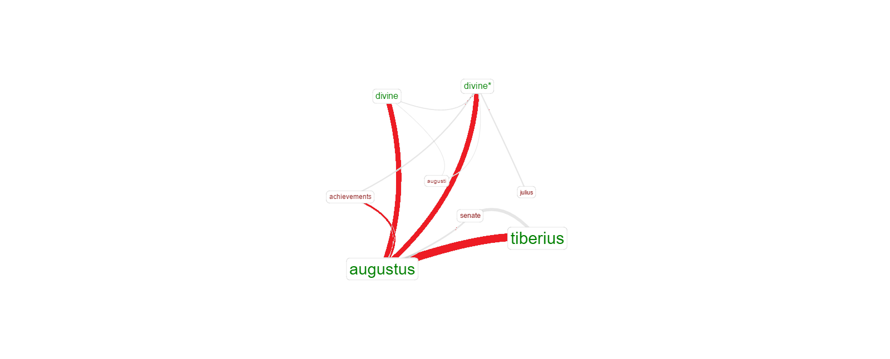

# Divinity and Imperial Cult

# Question

By looking at both ancient and primary sources this project will analyze the usages of the words divus and deus and how they are attributed to the emperors Augustus and Tiberius. We will use classical and new research techniques to better understand the divination process and how they were seen by Romans within the heart and on the fringes of the new Empire.

So far the thoughts seem to disagree only in the severity of who actually believed Augustus to be a living breathing god and who believed he was the hero of Rome and wanted to call him something appropriate. The people of Rome, especially the patricians knew that Augustus was not in actuality a god, but rather a very experience leader and politician. It would seem that some historians think that the people who live on the fringes of the Empire and performed ceremonies did so for personal reasons, knowing that the emperor would never know about them particularly. I theorize that the well to do educated elite of Rome simply indulged in the culture at the time of giving him the highest office possible, that being of mythic proportions, and that the people who might not have been in the know thought that he actually was a god in mortal form based off of all the literature and stories about his conquest over Marc Antony. Monuments and statues were almost exclusively set up in the center of Rome so that the important figure heads could see them on a daily basis. This meant that the majority of the propaganda in favor of Augustus should have been based in Rome, yet we see examples in Suetonius that Augustus did not want to be worshiped within the city. This means that Augustus was Julius were “deified” in a manner that would satisfy their ego. Because these dedications were offered by both private individuals and the state we can see that these situations were prevalent on the whole socio-political society in Rome. In any matter, there is certainly worth reason into the historical study of the Imperial Cult.

# Historiography

Suetonius claims that Augustus should be worshiped with the embodiment of the deified Republic Roma. Augustus allowed for people outside the city of Roma to practice this worship, however, he adamantly rejected the idea of his own worship within the city of Rome, even going so far as to drop to his knees, tear off his toga, and with bare breast begged the people to stop insisting on his personal worship within the city(Suet. Life of Augustus). This shows that Augustus would cautiously avoid divine honors specifically within the city. Suetonius also mentions that Augustus gathered thousands of prophetic writings and burned them, all the while he went through the Sibylline books which were texts of the sacred and ancient religion in Rome called the Cybele Cult and systematically went through choosing which passages to keep and which to disregard before depositing the edited editions into two gilded cases underneath the pedestal of the Palatine Apollo temple.

The concept of isotheoi timai was the term for the divine honors given to a man that could otherwise be given to the gods in Greece in the 4th and 5th centuries BCE. Nicolaus of Damascus coined that term stating that the imperial family held special privilege that previously were only granted to the gods. Other modern historians analyzed the term and claimed that it was simply a superficial way to make the recipient feel special. He says that that is why they would say that these men were called divus not deus.(1) He writes a marvelous sentence that I will not attempt to recreate in fear of diluting, ” The emperors were in a way and from an institutional point of view, gods without being gods, just as they were monarchs without being monarchs, since the powers shaping the imperial office simply made emperor's official representatives of the Republic”.(2) What he is saying is that the people might “worship” these emperors like Augustus, but it was in such a way that was done so to signify that the Emperor is simply above their social and political position. He claimed that even the term “imperial cult” was just a blanket term used to described the vast amount of honors and rites celebrated to the Emperor and his role as representative to the State similar to isotheoi timai. These men are given the title dives which would be closer to hero, given its initial meaning in latin was wealthy, rather than being called deus, or god. In areas outside of Rome in places such as North Africa and Pergamon, the people there  recognized the religious movement of the imperial cult with actual ceremonies and offerings. One author writes that the people who lived in these areas worshiped not only the goddess Roma, but also Augustus. Other authors argue against this, stating that since the dedications in the area were mostly for local magistrates, he thinks that meant that the people in the provinces did not actually believe the emperors were gods. These thoughts were modern views, with Cassius Dio writing that the people of Pergamon worship Julius Caesar more than Augustus because they did not believe in worshiping a living deity (3). This is interesting that they put a restriction on what they worship because that means that they believed heavily that after death, Caesar, actually became a god. 

The first primary source that was analyzed was the first book of Tacitus’ Annals. I only looked at the first book because the majority of the context of Augustus was written about there, whereas the later books write on Tiberius. When doing research Tacitus says that he is going to write about him objectively alongside other topics such as Tiberius. As Tacitus writes, “...without either bitterness or partiality, from any motives to which I am far removed”, claiming that he had no motives towards the negative depicting of the “Prince” as he calls Augustus(Tacitus, Annals, 1.1). He veils his true depiction of Augustus with subtle innuendo and sarcasm because he writes his work in 109 CE only a century after Augustus himself has died and become deified and does not wish to upset the normal praise of Augustus openly. In his work, Tacitus slides words into the sentence that could have other wise been left out or worded differently if he wanted to truly praise the subject, but instead, he tells the reader that Augustus gave out “cheap” corn, and that he does certain actions to support his despotism(Tacitus, 1.2-3). Tacitus often alludes to the decline of the Roman civilization and how, when read analytically, one can see without much context that he is a man who reminisces for the times when Rome was still a Republic. One of the most attributable thoughts that Tacitus has on the concept of the Imperial Cult was its impact on the Roman state religion. He writes that once an individual such as Augustus was accepted to be worshiped like a deity, given temples and followers such as the flamen and other priests, there were no longer any room to honor the Roman gods(Tacitus, 1.14). Tacitus believed that once a human was able to be worshiped like the gods that the Roman people had worshiped for almost a millennia, the shape of their religion would have been soiled henceforth. Tacitus even writes that after the death of Augustus, during the reign of Tiberius, senators would burst into compliments and tears upon the knees of Tiberius in order that they might not misunderstand the emperor(Tacitus,1.15). Tiberius, also wishing to further advance personal agenda brought up the deifying of his stepfather to the military. He incited Augustus’ name to the legions to associate his divine right to rule over them being his father being made god-like(Tacitus, 1.30). The only other depiction of the impact Augustus had on the working soldier class was that after his death, the newer more liberal legions, under the command of Silius stationed with the Ubii in Gaul, exhibited a sense of impatient laxity and began to undermine the veterancy of the legions and demanded more pay for the newer recruits(Tacitus, 1.38). This shows a few things, first it meant that enough of the veteran legions that served when Augustus was predominantly in command survived, and that the newer legionnaires thought that they deserved more pay from Roman military expenses. Also it showed that the younger soldiers who had not been alive turning the coup d’etat of the princeps neither feared nor respected him in the same way that the older legionnaires had.  

The Aeneis was a literary epic written by Virgil through the decade from 29 to 10 BCE. In it has a form of propaganda aimed at legitimizing the religious and political implication that then Octavian was descended from the gods and that legitimises him as the leader of the Roman Republic. Since Augustus was the benefactor behind the production of this work it is not hard to believe that Virgil would write about the greatness of his patron. In book 6 Virgil's writes about an encounter that Aeneas has with his father that he meets in the underworld. In this conversation, Aeneas’ father, Anchises, tells Aeneas that he will go on the found a city called Alba Longa in Latinum, and that two boys will be some of its descendants, It is Romulus and Remus who will go on to found the city of Rome and that that city is the reason that the gods are making him keep moving throughout the Mediterranean. He goes on to tell Aeneas that there will be this guy named Julius Caesar who places Rome as this city upon a hill. Then, will come Augustus, son of the deified Caesar, who will lead Rome into its Golden Age. He writes that under Augustus, Rome will stretch so far and wide, that not even Hercules had walked so many steps, also how even though he famously shot the bronze footed Acadian deer, he had brought peace to the woods of Erymanthus. He goes on to say how great Augustus would be and how he would be compared to various gods of the time in the following sentences(Virgil, Aeneid, lines 789-807). This early form of comparison with the gods surrounding the founding of Rome would certainly helped to assert himself within the pantheon of the Roman religion though the minds of the literate people reading this. Everyone across the Mediterranean that had access to this piece of literature would have read that before even the founding of the city, Augustus was made the front standing man that would lead Rome into the Golden Age a decade after he declared himself princeps.   

The last and most interesting of the primary sources that I analysed was the autobiography Augustus wrote about his life that was made to be published posthumously. In it, he only refers to the various cults surrounding him a few times, but mostly mentions the social and political impacts that he had on the nation. When discussing his worship he does so with an open nature not trying to hide or imply anything. In the ninth chapter of his writing he mentions that a decree was passed by the senate stating that every fifth year, various priests and colleges, both public and privately were to pray for his health. In the tenth and eleventh chapters he writes that his name would be submitted as being sacrosanct, meaning that his body was considered to be holy in that it could not be touched by regular people, and that an altar was set up in Campanian gate which was worshiped by Vestal virgins every time that he visited the area. He then mentions the altar of Augustan Peace to be set up for him on the field of Mars and that it partook in annual sacrifices(Augustus, Deeds of the Divine Augustus, 12). One tricky line that Augustus tells is that in about 80 cities in Asia had silver statues of him both on foot and on horseback, he claims to have removed the statues from the temple, but then says that he donated sums of gold in his own name to those same temples. That would imply that he did not want people to believe that he supported the outright worship of him, yet, he did want to associate the worship of the temple with himself by donating gold under his name. To go full circle on the illusion that he wished to cast over the roman people, he writes that after his seventh consulship, after he subdued the civil war, he personally handed over the State to the Roman Senate, and afterwards he held the virtue, justice and piety bestowed to him by the Roman people yet never held any title greater than others holding the same title(Augustus, 34). By saying this he wanted people to believe that he gave back the supreme power he obtained winning the civil war, making him the first man in Rome, to the Senate. He then goes on to claim that even though he held such prestige among the Roman civilian population and even though he held enough offices to make him the most powerful man within the city, he still was no more powerful than anyone else. This would be his most thought out move and ensured that he ruled Rome behind the curtain until he established a political network loyal to him, which was something that Julius Caesar failed to do decades earlier, getting him assassinated.

# Work Flow

1. Access Text
  * [Tacitus' Annals](http://classics.mit.edu/Tacitus/annals.1.i.html)
  * [Virigil's Aeneid Book 6](http://classics.mit.edu/Virgil/aeneid.6.vi.html)
  * [The Res Gestae](http://www.skidmore.edu/academics/classics/courses/2007spring/hi363/resgestae.pdf)
2. Webscrape the data if possible, and created a .csv.
    * I used the webscraper.io extension for google Chrome
        - This provided me with a csv that I was unable to use due to the inability to separate the text by paragraph
    * A python script to pick up each individual paragraph into its own row on a csv would have been more beneficial.
    * Since the csv I produced was ineffective, I put the pdfs directly into Voyant Tools.
3.  Access Voyant Tools or OverviewDocs. (I would have preferred Overview but was unable to get the data into csv form, making Voyant the only option to me.)
    * I chose to focus on Augustus and Tiberius for vocal points for collocates
        - I looked through the collocates within 3 words before and after searching for mentions of divine or wealth.
        - I found a few with divine that I attempted to create a network.
    * I accessed the links tool to create a network to see how each of the words were connected.
        - I removed the words that were related but not relevant to the connections I was seeking. This is subject to user discretion.
    * I attempted to create a graph of the collocates and see broader connections but was unsuccessful. 
        - I then tried  to create a spreadsheet of the collocates of Augustus and Tiberius.
        - I was unsuccessful but was able to create a spreadsheet of the word counts.
    * If I had been successful creating the spreadsheet of the collocates, I would have uploaded the file to overview docs to try to see connections between the different collocates.
        - This I would recommend the tree tool for broad connections.
        - For closer connections I would have found the collocates with divine or wealth as key terms and group them together.
4. Since I was unable to create the spreadsheet with the collocates, I uploaded my spreadsheet of the word counts into Tableau.
    * This was a mostly fruitless endeavor as with only the word counts nothing of value could be graphed or visualized to my efforts.
    * With a different csv or multiple ones with greater skill in creating I believe that there would be a visualization to be of value.
5. After words I analyzed the data I was able to collect to draw preliminary conclusions to our question.

# Initial Impressions

The initial results from our project revealed a distinct connection between the language used to describe the Emperor and divinity. While there was a lack of evidence referencing the wealth and power of the Emperor that is likely due to the sample size of literature. This small scale project indicates that this idea should be investigated more throughly. The graph we managed to produce shows a distinct correlation between divinity and Augustus. This graph was surprising due to the lack of connection to divinity and Tiberius. I believe that this lack of evidence has to due with the point in time the works were written, as after the death of an Emperor they are deified. However, this connection between the living Emperor and Divinity could have valuable insight into the cult of the Emperor during his reign, and allow for a to see how these writers saw the Emperor. 

 If we were to take this project forward we would have to make a few alterations to the concept and overall way to come at the question. Continuing we would need to have more primary literature sources and keep them in the original Latin or Greek, to make sure we are getting an accurate showing of the Emperor over all periods and this way we would be able to see larger trends over time. This increase in the volume of material would significantly improve the viability of the results. This project with more time and resources available could reveal some new insights into the divinity and power of the Emperor as seen in the literature of the time. This process could also allow for these text to be analyzed in a new way to answer different questions using the same methods and materials. We believe that textual analysis on Roman Literature will reveal connections and bring questions that previously went unasked or answered. 

# Bibliography

 1. Van Andringa, William. "Rhetoric and Divine Honours: On the "Imperial Cult" in the Reigns of Augustus and Constantine." Collegium 20, (January 2016), EBSCOhost 
 2. Ibid 11. 
 3.Friesen, Steven J. 2001. Imperial cults and the Apocalypse of John: reading Revelation in the ruins. Oxford: Oxford University Press. 26

