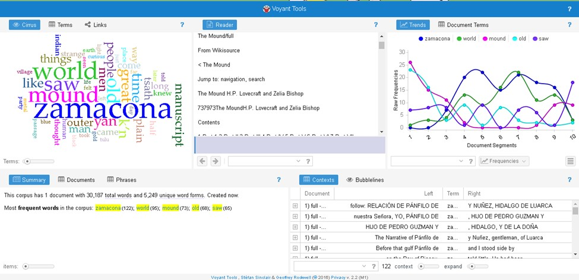
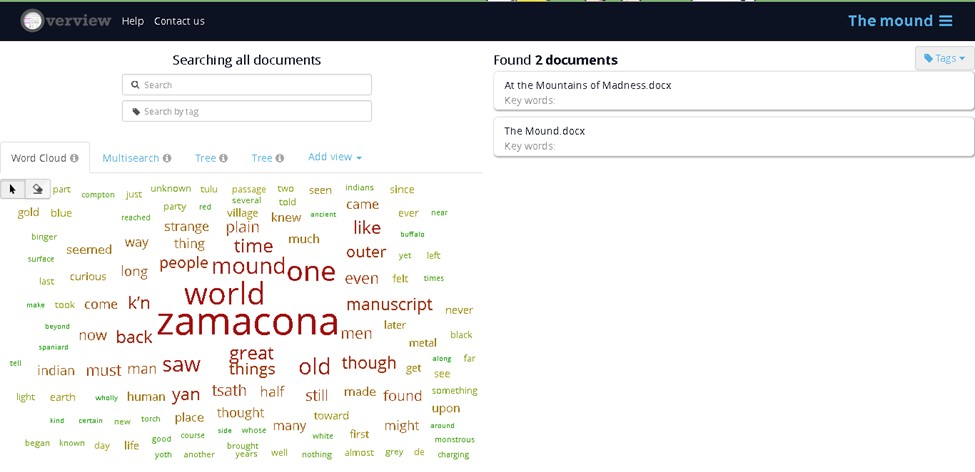

# The Problem

The idea for this project came from a recent 2014 discovery of a trunk full of letters in the possession of Zealia Bishop’s great niece. Zealia Bishop was an early 20th century American romantic fiction writer whose main claim to fame was three horror stories published in her name The Curse of Yig, Medusa’s Coil and perhaps most notably The Mound. These stories stand out from her usual repertoire not only because of the genre but also the writing style, which is incredibly similar to that of Howard Philips Lovecraft.

Lovecraft was an early 20th century American horror science fiction writer who made a name for himself through his extensive publication in weird fiction magazines and through his correspondence with a massive number of other early 20th century American fiction writers including Robert Bloch, Clark Ashton Smith, Robert E. Howard and Zealia Bishop. This correspondence was both personal and professional as Lovecraft gained a reputation as something of an editor who provided advice and critique for aspiring writers. Zealia Bishop was one such example of someone Lovecraft corresponded with and gave advice to. 

After a few years of letter writing Zealia Bishop essentially commissioned Lovecraft to write The Curse of Yig, Medusa’s Coil and The Mound, all of which were published in her name. These stories are sometimes classified as collaborations and sometimes just as ghostwritten since Bishop’s input was simply a one to two sentence premise that Lovecraft expanded on. It was not until long after Lovecraft’s death that these stories saw publication in his name because despite their obvious similarities to Lovecraft’s other work his Cthulhu mythos was an open universe which he encouraged other writers to contribute to. Finally with the discovery of Bishop’s letters to Lovecraft in 2014 scholars have definitive proof that Lovecraft was essentially commissioned to write these three stories, whereas before it was just a widely held suspicion. 

It is through this that my essential question began to emerge: what if there were some way to prove authorship through digital means? If the technology and method are there an absolute cavalcade of fiction, especially that of the early 20th century when ghost writing was very common, could potentially have their proper authors attributed to the work. This type of technology is not just applicable to this time period, any writing still intact from any century could have its authorship called into question. The sky truly is the limit in what could be discovered from technology like this. Problems of course arise from the fact that similar syntax does not always equate to authorship though a computer program might attribute it to be. 

This is particularly true in the case of H.P. Lovecraft whose style is very distinct yet is often emulated by other horror authors to great effect, something that might cause a program to attribute him as the author. Despite these problems this projects goal is one that could have a great impact in scholarly circles interested in attributing authorship to its true source and discover plagiarism from a period of time when it was not as easy to find.

# Scholarship

When it comes to H.P. Lovecraft one need not look much further than S.T. Joshi. Joshi is considered to be the definitive authority on all things Lovecraft and deservedly so. He is an extensive writer and bibliographer on weird fiction writers from the early 20th century. However his historiography is one absolutely grounded in tradition. This of course is never a bad thing, his work began long before the onset of the internet age and his work even after the rise of the internet reflects that. Essentially what this means is that there is no real digital scholarship related to H.P. Lovecraft and his associates. Joshi being such a dominant historian in this field limits scholarship to being one of consultation. For example, those letters previously mentioned were proved to be legitimate because Joshi deemed them to be. This of course is not to disparage Joshi, far from it in fact, having read a number of his papers and books the man is nothing if not thorough and well-reasoned. The point is that Joshi may not be the only scholar in this field but, especially when it comes to Lovecraft, he may as well be. So when historians finally begin to move from the libraries to digital methods of research Joshi is unlikely to be as open to such methods. The closest thing we have to digitalization of anything Lovecraft related is that his works are all public domain and therefore are available online. This gap in Lovecraftian scholarship is one just waiting to be filled and I don’t think Joshi would object to using digital methods. The concern from having one definitive source or person knowing everything there is to know about a subject is from the void that will be left in the event that he passes away. Who then will look at a ghost written paper or long lost letter and be able to determine its authorship? Digital means will always be available, people unfortunately will not.

This is only one of the problems that this project intends to tackle, the other being the potential detection of ghostwriting itself. Moving away from Lovecraft a little bit it is important to discuss the problems that arise not just from ghostwriting in fiction but in academia as well. As we know ghostwriting has been around much longer than the internet, yet with the internet its prevalence in academia (especially in medicine) has skyrocketed and it is important to try and understand why. Before the internet existed plagiarism was much harder to detect in academic writing. Plagiarism was certainly not uncommon during this time and the only way to be caught was on the suspicion of the professor. Today we have programs like “Turnitin” which automatically sifts through a massive database in order to detect plagiarism. This program is built into many of the digital assignment submissions in colleges and as such plagiarism, when caught has incredibly brutal punishments. Most college students are careful in how they do their research and cite their sources because of this program, it has certainly forced me to be much more cautious in how I paraphrase and cite other people’s work. However students will continue to be students and there will always be other ways to cheat the system. This is where ghostwriting in academia comes in.

When students get lazy it is only too easy to hire someone else to do all of your writing for you. Ghostwriting is a problem in colleges because it is so difficult to detect. Unlike plagiarism you cannot just put a massive number of academic writings into a database and program it to search for similarities. Most ghostwriters for hire are not academics and as such there is no active archive of all their written work to compare submissions against like there would be for someone like H.P. Lovecraft. If an instructor knows his or her students then finding a paper clearly written by someone else should be easy since everyone’s writing voice is distinct. In college most classes are much larger on average than high school, often containing several hundred students most of which will never meet their professor one on one let alone have their papers even graded by their actual professor. Instead one of potentially several teaching assistants will probably grade an assignment that the professor has been using for years with little change making the job of ghostwriting that much easier.

What does all this have to do with scholarship related to this issue? I bring up the problems created by ghostwriting and the difficulty in its detection for a very important reason: there is next to nothing being published on ghostwriting at the undergraduate level in college. Most academic material published on ghostwriting is about people doing it in the upper levels of medical education and on their dissertations because when it occurs at this level it is substantially easier to detect due to smaller class sizes and more intimate relationships between student and instructor. However most ghostwriting occurs at the lower levels of academia where it is much easier to get away with. There currently exists no “Turnitin”-esque program that will automatically detect this form of cheating for the instructor and so it is up to the instructor to be vigilant. My pursuit in this project and call for some form of text analysis software will probably do little for this problem of ghostwriting in academia, it is just important to understand that this problem exists and it could be useful for another much more talented academic than myself to pursue for a broader usefulness than just detecting whether or not a particular 20th century fiction author ghostwrote for another.

Whether or not it is even possible to make some sort of ghostwriting detection program that would have any use in academia is completely beyond me though it seems as though it is not possible. Let us instead focus on the interest at hand, which is using samples of an author’s previous work and trying to match them up against a different author’s in order to detect similarities. Perhaps one day this technology could be extrapolated to solve more pressing academic problems than historical authorship.

# Workflow

My workflow was rather simple if a knowingly futile effort. I began with my first program “Voyant”. This tool checks for word frequency of use and in what places words are used most frequently. By punching in my document “The Mound” by simply copying and pasting the entire text into the box (done easily since the text is public domain and therefore available online for free). The visualization produced gave exactly what you would figure the program would give, a word frequency chart by section of the document, a neat “word cloud” visualization and an actual number of words. For the purpose of my project this program doesn’t do a whole lot since I can only check one document at a time without the ability to cross reference.

* Getting the Data
    - Source: hplovecraft.com/writings/texts/fiction
    - Method: Searched both stories and copied them
* Voyant
    - Go to https://voyant-tools.org/
    - Paste your text entry into the box
        + Press "reveal"
        + Data will be displayed
* Overview
    - Go to https://www.overviewdocs.com/
    - Create an account
        + Paste your text onto a word document and save
        + Upload document(s) into overview
        
Next up was the program “Overview Docs”. This text analysis software allows for the cross referencing of multiple documents as long as you upload them in file form. In order to do this I simply copy and pasted the works in question from online into separate word documents that I saved and then uploaded into the website. Unfortunately this website’s power for analysis appeared to be much more limited than “Voyant” only allowing for a search bar and a less appealing “word cloud” which gives only the faintest idea of word frequency.
As expected there is no perfect program out there for me to benefit from in doing my research which makes my call for its creation all the more compelling.

# Initial Impressions





Above are the images that were gathered from the first and second site visited respectively. Alone these images do not offer a whole lot of information, but they are important for showcasing how limited text analysis software currently is. Being able to see word frequency is interesting for some projects, but they are limited in scope and will likely result in nothing other than a fun little nugget of irrelevant information. As an amateur historian the information sought after here needs to be more substantial. Of course this was something of an expected outcome going into the project, the point then being to incentivize others to create a text analysis program capable of doing more than just fancy word count. So becomes the concluding point of this project, not to actually present any sort of substantial new research but instead to propose some sort of fix to this problem and call attention to its existence. Ghostwriting in fiction is what it is, an unfortunate occurrence that leads to misattributed work. In academia though, it is akin to plagiarism except perhaps even worse. Not only does it not properly attribute an author, but it leads to literally zero work from the person who hires the ghostwriter and leads to an undeserved rewarding of a degree. If this problem continues to grow with the size of college classrooms then a serious deterrent needs to be put in place beyond just academic dismissal if caught. Schools need a turnitin style ghostwriting software to detect differences in syntax between papers.

# References

```
Evans, Timothy H. A Last Defense against the Dark: Folklore, Horror, and the Uses of Tradition in the Works of H. P. Lovecraft. Indiana University Press. 2005. 

Hammer, George. "How to Exorcise Academic Ghostwriting." The Phi Delta Kappan 57, no. 5 (1976): 328-30.

Janicker, Rebecca. 2007. "New England Narratives: Space and Place in the Fiction of H.P. Lovecraft". Extrapolation. 48 (1): 56-72.

Joshi, S.T.. A Dreamer and a Visionary: H.P. Lovecraft in his Time. Liverpool University Press, 2001.

Joshi, S.T.. The Weird Tale. University of Texas Press. 1990.

Riley, Linda A., and Stuart C. Brown. "Crafting a Public Image: An Empirical Study of the Ethics of Ghostwriting." Journal of Business Ethics 15, no. 7 (1996): 711-20.

Robillard, Douglas. American Supernatural Fiction: From Edith Wharton to the Weird Tales Writers. Garland Publishing, Inc. 1996.

Tanne, Janice Hopkins. "Most Leading US Medical Schools Lack Rules on Ghostwriting." BMJ: British Medical Journal 340, no. 7742 (2010): 334.

Tymn, Marshall B. and Mike Ashely. Science Fiction, Fantasy and Weird Fiction Magazines. Greenwood Press. 1985.


```
